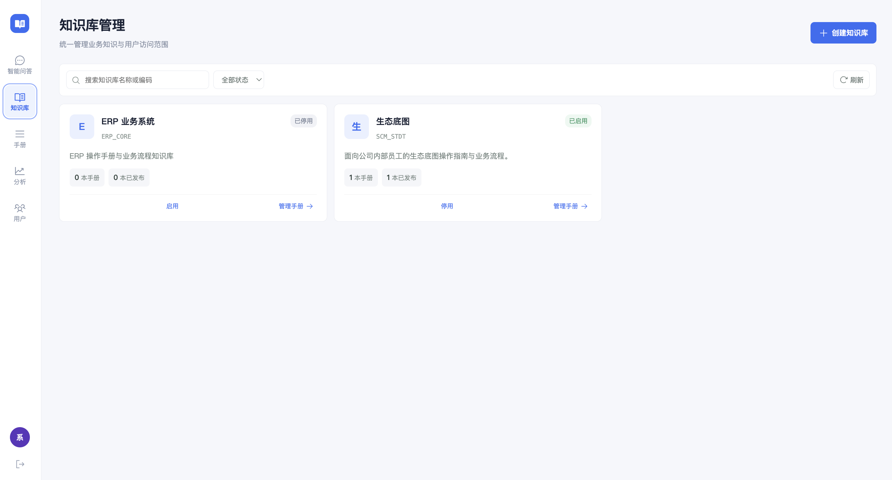
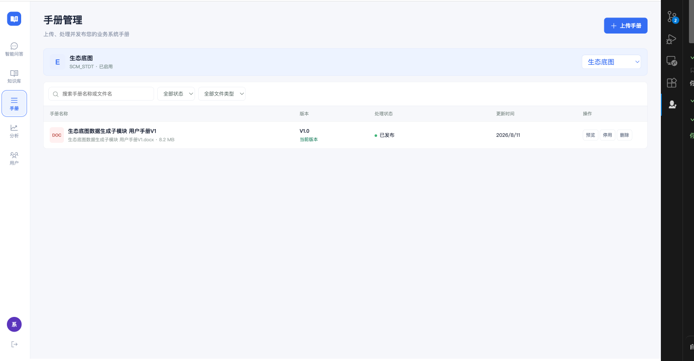

# 知识库与手册管理流程审查

## 流程步骤

1. 知识库列表 — 一般：信息清楚，但“管理手册”没有把知识库上下文带入下一步。
2. 某知识库的手册管理 — 较差：页面自行选择默认知识库，上传弹窗也再次独立选择，容易操作错库。

## 截图证据

### 1. 知识库列表

### 2. 手册管理

## 主要发现

- [P1] 数据是父子关系，导航却表现为同级关系。知识库和手册在左侧并列，用户无法判断应该先进入知识库还是直接进入手册。
- [P1] “管理手册”只切换页面，没有传递当前卡片的知识库 ID；手册页重新选择第一个启用知识库。
- [P1] 上传弹窗再次独立加载知识库并默认第一项，可能把文件上传到错误知识库。
- [P2] 手册页标题、上下文条和下拉框重复表达当前知识库，但没有返回父级的明确路径。
- [P2] 两页的搜索和筛选控件没有实际过滤行为，用户输入后界面没有变化。
- [P2] 禁用知识库时仍可能看到上传入口，状态和可执行动作缺少约束。

## 可访问性风险

- 当前筛选控件依赖 placeholder 表达用途，建议保留明确的 `aria-label` 或可见标签。
- 卡片底部两个文字按钮层级相近，主要动作不够突出。
- 操作后的加载、成功和失败反馈仍需后续补充，截图无法验证键盘顺序和读屏播报。

## 已实施调整

- 左侧只保留“知识库”入口，手册管理成为知识库下的子流程。
- 点击卡片时传递知识库 ID，并在页面、切换器和上传弹窗间持续保存。
- 手册页增加“返回知识库”路径。
- 上传弹窗默认使用当前知识库；知识库未启用时禁用上传。
- 知识库和手册搜索、状态筛选、文件类型筛选改为真实交互。
- 增加无数据和无匹配结果状态。

## 证据限制

本轮使用用户提供的两张当前界面截图完成初始审查。改版后的浏览器截图和键盘/读屏测试尚未完成。
